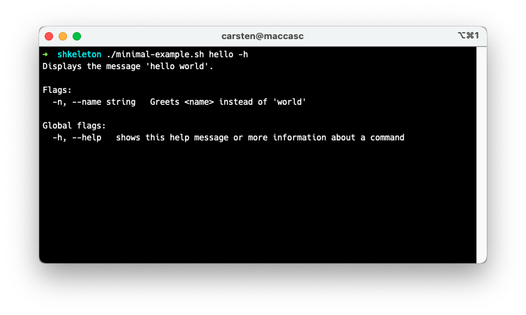
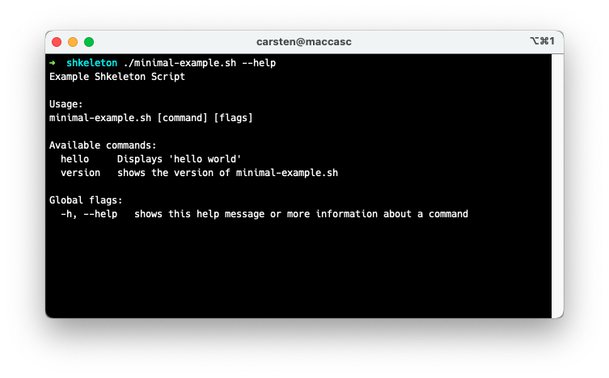

# SHKELETON - Bash Script Template

Shkeleton is a library that provides a convenient way to structure and
organize your bash scripts and assists you in writing versatile and easy-to-use programs.

## Features

Shkeleton makes it easy to 
- parse flag and argument options
- generate extensive usage information
- write scripts with different commands
- setup and cleanup the environment
- debug and trace your script

In addition to that, it offers functions to colorize output and emit error messages.  

## Minimal Example
Suppose this executable (chmod +x) `minimal-example.sh`:

```bash
#!/bin/bash

app_version="1.0.0"
app_description="Example Shkeleton Script"

source shkeleton.sh

function setup() {
    cmd "hello" "hello_world" "Displays 'hello world'"
}

function hello_world() {
    arg "n" "name" "string" "Greets <name> instead of 'world'"
    name=${arg:-world}

    if $flag_help; then
        printf "Displays the message 'hello world'.\n\n"
        print_usage && exit 0; # Print usage and exit
    fi
    
    debug "Debug log message"
    
    echo "hello ${name}" | green
}
```

**Executing the hello command**


**Showing the hello help**



**Showing the script help**


